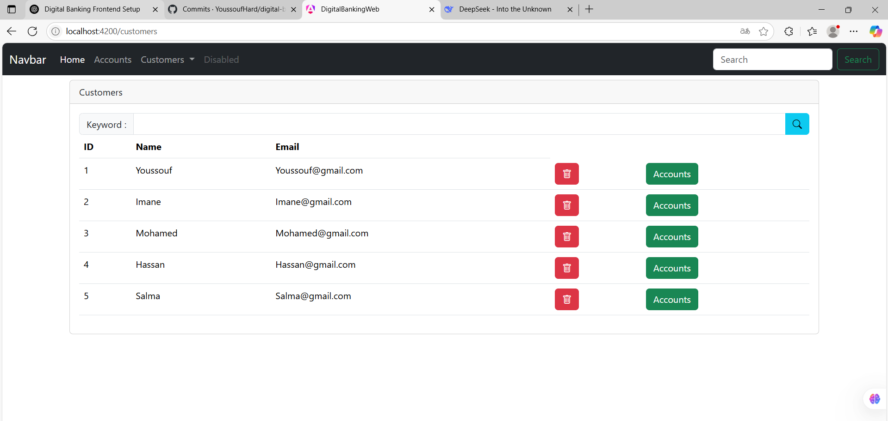
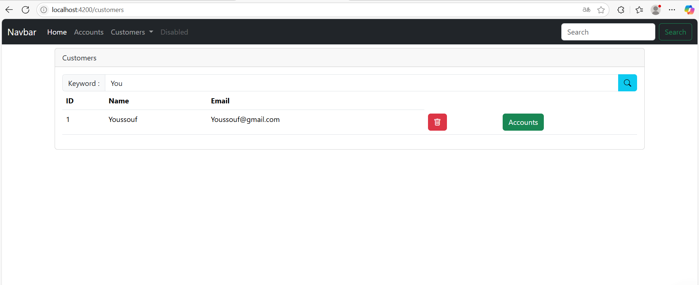
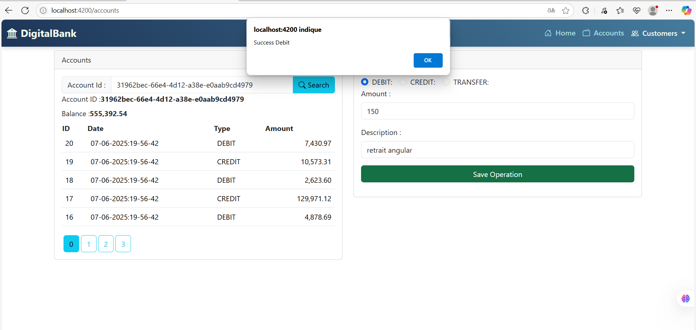
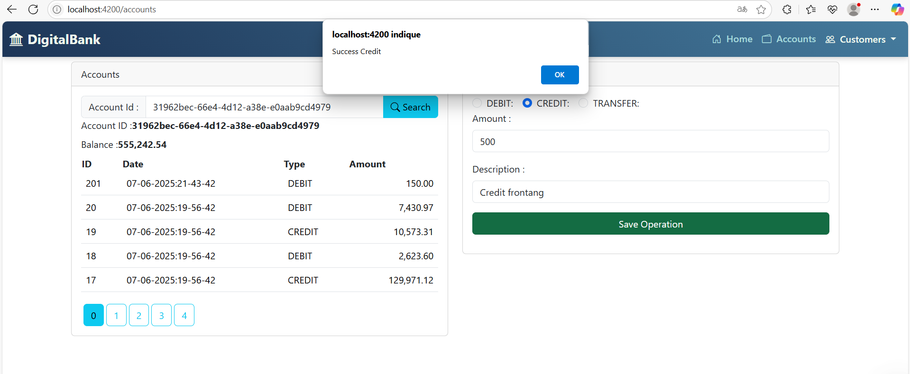
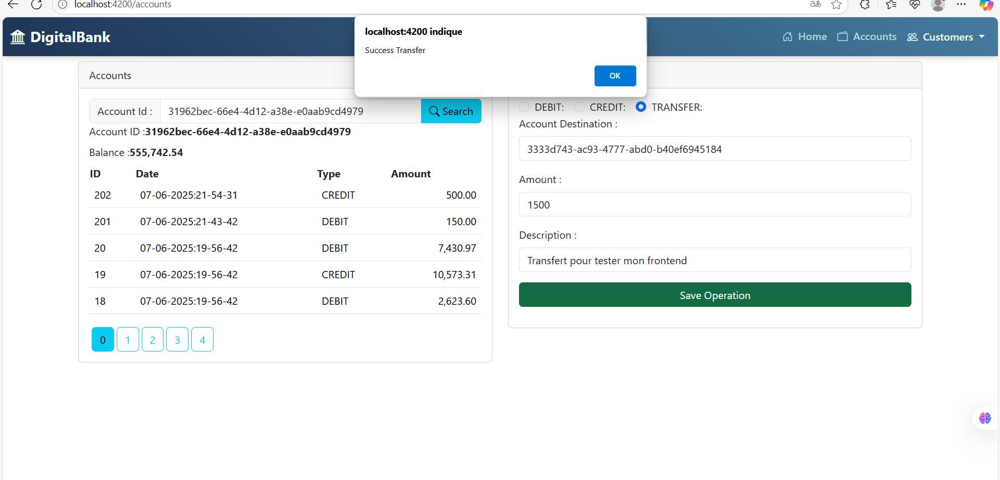
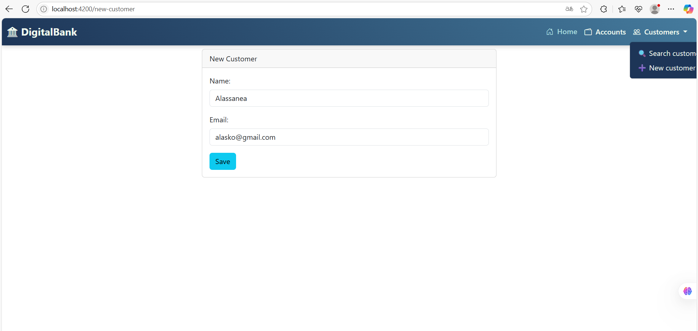
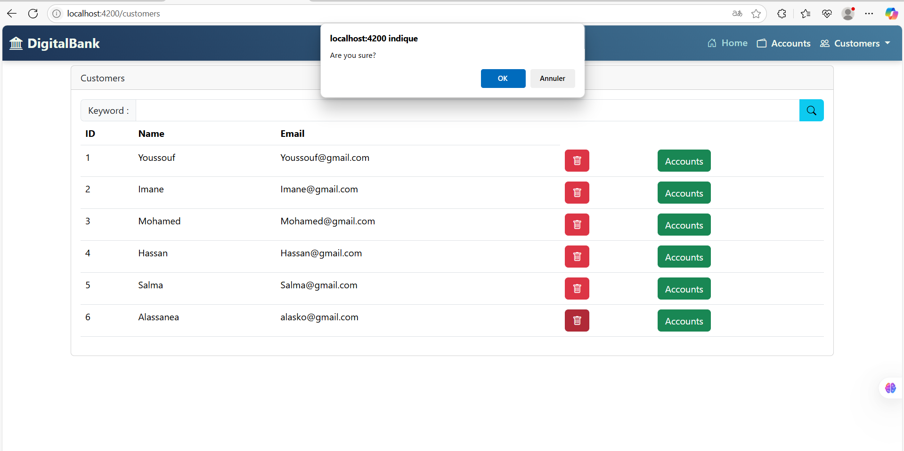
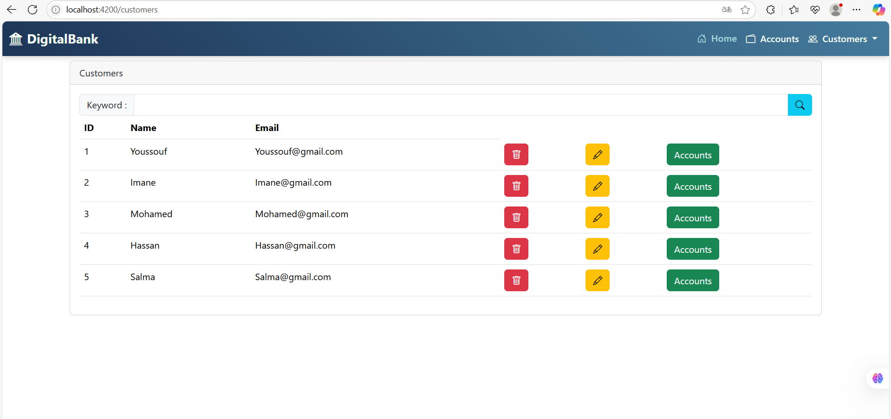
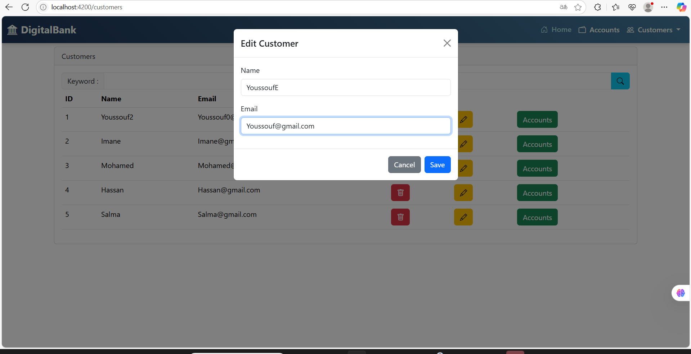
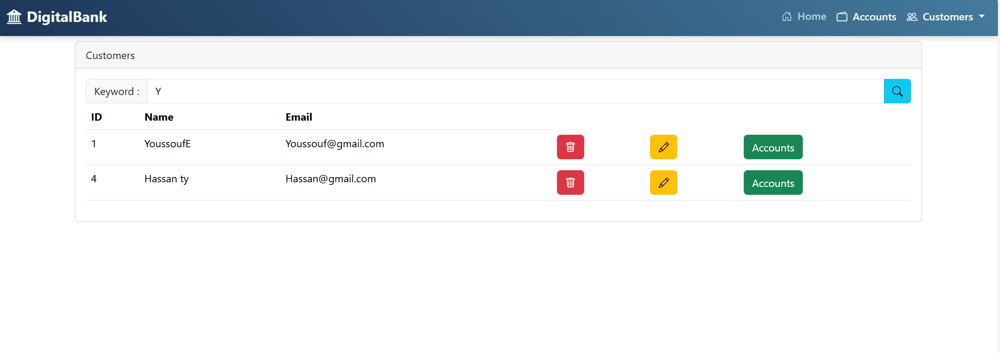

# 📱 DigitalBankingWeb

> Frontend Angular de l'application **Digital Banking**, permettant la gestion des clients et comptes bancaires avec authentification sécurisée via **Spring Security + JWT**.

Ce projet a été généré avec [Angular CLI](https://github.com/angular/angular-cli) version **19.2.7**.

---

## 🧪 Sommaire

* [🚀 Lancer le projet](#-lancer-le-projet)
* [🏗️ Build](#️-build)
* [🧪 Tests](#-tests)
* [📁 Structure du projet](#-structure-du-projet)
* [✅ Fonctionnalités réalisées](#-fonctionnalités-réalisées)
* [📸 Captures d’écran](#-captures-décran)
* [🛠️ Fonctionnalités à implémenter](#️-fonctionnalités-à-implémenter)
* [📚 Ressources utiles](#-ressources-utiles)

---


## 🚀 Lancer le projet

Pour démarrer le serveur de développement local :

```bash
ng serve
```

Naviguez ensuite vers [http://localhost:4200](http://localhost:4200). L’application se rechargera automatiquement en cas de modification des fichiers sources.

---

## 🏗️ Build

Pour compiler l'application :

```bash
ng build
```

Le build sera généré dans le dossier `dist/`.

---

## 🧪 Tests

### ✅ Tests unitaires

```bash
ng test
```

### ✅ Tests end-to-end (e2e)

```bash
ng e2e
```

> ℹ️ Angular CLI ne fournit pas par défaut de framework e2e. Vous pouvez utiliser Cypress, Playwright ou autre.

---

## 📁 Structure du projet

```bash
Projet/
├── node_modules/
├── public/
├── src/
│   ├── app/
│   │   ├── accounts/
│   │   ├── auth/ # Login, register (avec JWT)
│   │   ├── customer-accounts/
│   │   ├── customers/
│   │   │   ├── customers.component.css
│   │   │   ├── customers.component.html
│   │   │   ├── customers.component.spec.ts
│   │   │   └── customers.component.ts
│   │   ├── dashboard/ # Graphiques ChartJS
│   │   ├── model/
│   │   ├── navbar/
│   │   ├── new-customer/
│   │   ├── services/
│   │   │   ├── accounts.service.ts
│   │   │   ├── accounts.service.spec.ts
│   │   │   ├── customer.service.ts
│   │   │   └── customer.service.spec.ts
│   │   ├── app.component.ts/html/css
│   │   ├── app.routes.ts/.server.ts
│   │   ├── app.config.ts/.server.ts
│   ├── environments/
│   └── index.html
```

---

## ✅ Fonctionnalités réalisées

* ✔️ Authentification sécurisée avec **Spring Security** & **JWT** (backend Spring)
* ✔️ Interface utilisateur Angular avec navigation via `navbar`
* ✔️ **Affichage des clients**
* ✔️ **Recherche dynamique** des clients
* ✔️ **Services Angular** pour consommer l'API REST sécurisée
* ✔️ Architecture modulaire : `customers/`, `accounts/`, `services/`, `models/`, etc.
* ✔️ Utilisation du **Routing** Angular

---

## 📸 Captures d’écran


### 🧍 Liste des clients



### 🔍 Recherche en temps réel d'un client




### 🔍 Recherche de Compte

* L'utilisateur saisit l'ID du compte dans le champ prévu et clique sur **Search**.
* Les informations affichées incluent :

  * ✅ **Account ID**
  * 💰 **Balance**
  * 📄 **Historique des opérations** (avec pagination)

#### 📑 La capture d'un exemple d’opérations :


### ⚙️ Opérations Disponibles

L’utilisateur peut effectuer les opérations suivantes sur le compte affiché :

* **DEBIT** : retirer une somme du compte
* **CREDIT** : ajouter une somme au compte
* **TRANSFER** : transférer une somme vers un autre compte






Chaque opération nécessite :

* un montant
* une description
* un compte destination (pour TRANSFER)

Un bouton **"Save Operation"** valide l’action.

---

## 🛠️ Fonctionnalités à implémenter

### 📌 Gestion des Clients

* [x] Ajout de nouveaux clients

  

* [x] Suppression et modification

  

  

  
* 
* [x] Recherche dynamique

  

### 💰 Gestion des Comptes

* [ ] Création de comptes bancaires (courants, épargne)
* [ ] Recherche, administration, affichage des comptes

### 👤 Authentification

* [x] Login sécurisé avec JWT
* [ ] Enregistrement de l’utilisateur associé à chaque opération
* [ ] Changement de mot de passe utilisateur

### 📊 Dashboard (Statistiques)

* [ ] Graphiques via **Chart.js (ng-chart)** : répartition des comptes, activité par utilisateur, etc.

### 🧩 Autres fonctionnalités potentielles

* [ ] Pagination de la liste des clients
* [ ] Tri multi-critères
* [ ] Gestion des rôles utilisateur (admin, agent, etc.)

---

## 📚 Ressources utiles

* 🌐 [Angular CLI Docs](https://angular.dev/tools/cli)
* 📺 [Partie 2 : Angular Frontend](https://www.youtube.com/watch?v=bOoPKctcE0s)
* 🔐 [Partie 3 : Sécurité JWT](https://www.youtube.com/watch?v=n65zFfl9dqA&authuser=0)

---
